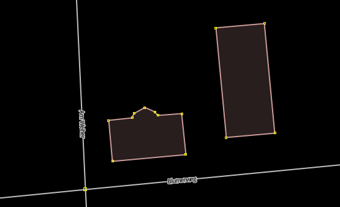

# buildingsplitter

JOSM plugin for splitting building ways in practical mapper workflows.

## Demo



## Features

- Manual split by drag line across a building.
- Manual split by 2-click workflow (corner/edge based).
- AutoSplit action for selected buildings (for simple 4-corner building ways).
- AutoSplit for clicking inside a building (no need to click near boundary).
- Optional address enrichment in AutoSplit:
  - `addr:street` (editable, with street suggestions)
  - `addr:postcode` (prefilled if uniquely detectable from visible context)
  - optional `addr:housenumber` sequence generation

## Usage

### Split Building map mode

1. Activate `Tools -> Split Building` (or map mode button).
2. Use one of these flows:
   - Drag line split: press, drag across one building, release.
   - Two-click split: first click near corner node, second click near corner/edge on same building.
   - Interior AutoSplit trigger: click clearly inside one building (not near boundary).
3. If the click is ambiguous (multiple corners/edges/buildings), the plugin asks for a more precise click.

### AutoSplit Building action

1. Select one or more valid building ways.
2. Run `Tools -> AutoSplit Building` (or toolbar button).
3. Configure parts and optional address settings in the dialog.
4. Confirm to finalize preview; cancel/skip keeps data consistent via preview undo handling.

## AutoSplit candidate rules

Current AutoSplit action validates strict simple building geometry:

- way must be `building=*`
- way must be closed
- exactly 4 distinct corners (`5` nodes including repeated closing node)

Non-matching selected ways are skipped/rejected with user feedback.

## Address context integration (optional)

Another plugin can provide one-shot defaults before AutoSplit dialog opens:

```java
import org.openstreetmap.josm.plugins.buildingsplitter.AddressContextBridge;

AddressContextBridge.setAddressContext("Main Street", "12345");
```

Default precedence in AutoSplit dialogs:

1. external context (`AddressContextBridge`)
2. last dialog values in current workflow
3. visible context detection (`VisibleAddressContextService`)

The bridge context is consumed once when AutoSplit flow starts.

## Requirements

- Java 11
- Gradle Wrapper (`./gradlew`)
- `libs/josm-tested.jar` present in this project (used as `compileOnly` and `testImplementation`)

## Build, test, package

```bash
./gradlew clean test
./gradlew jar
```

Useful targeted runs:

```bash
./gradlew test --tests "*SplitBuildingMapModeInteractionTest"
./gradlew test --tests "*BuildingSplitServiceTest"
```

## Local deploy to JOSM

`deployPlugin` resolves plugin path by OS and copies `buildingsplitter.jar`:

- Linux: `~/.josm/plugins/`
- macOS: `~/Library/JOSM/plugins/`
- Windows: `%APPDATA%/JOSM/plugins/`

```bash
./gradlew deployPlugin
./gradlew -q printPluginInstallPath
```

Additional tasks:

```bash
./gradlew installPlugin
./gradlew removePlugin
```

## Architecture overview

- `BuildingSplitterPlugin`: plugin lifecycle, menu registration, map mode wiring.
- `SplitBuildingAction` + `SplitBuildingMapMode`: manual map interaction (drag and click flows).
- `BuildingIntersectionService`: robust line/building intersection classification.
- `SplitNodePreparationService`: inserts required split nodes before final split execution.
- `BuildingSplitService`: executes final way split command chain and returns `SplitExecutionResult`.
- `AutoSplitBuildingAction` + `AutoSplitBuildingService`: batch-like AutoSplit workflow for selected ways.
- `AutoSplitPreviewSession`: preview ownership/finalize/rollback handling.
- `HouseNumberService`: address numbering order and assignment logic.

## Troubleshooting

- `No editable dataset is available.`
  - Ensure an editable data layer is active.
- `No building could be split with this line.`
  - Draw a line crossing exactly one building with exactly two valid intersections.
- `Line overlaps building edge; not supported`
  - The split line currently must cross, not run along an edge segment.
- `Multiple buildings match this click.`
  - Zoom in and click less ambiguously.
- `Click is too close to the building boundary.`
  - Click deeper inside for AutoSplit, or click near corner/edge for manual split.

## License

This project is licensed under GNU General Public License v2.0 only (`GPL-2.0-only`).
See `LICENSE` for full text.
